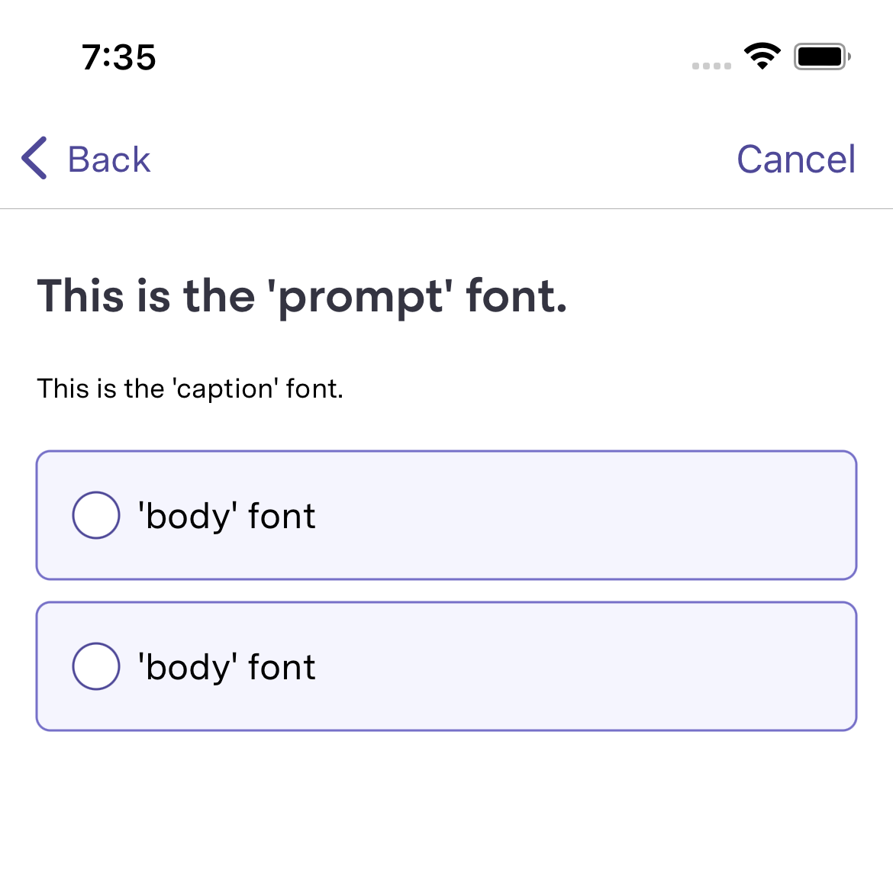

# typeform-swift

Swift library for parsing and displaying [Typeform](https://www.typeform.com) questionnaires.

If you're just getting started with Typeform, be sure to check out the [Developer Platform Documentation](https://www.typeform.com/developers/get-started/).

## Installation

This library is distributed using [Swift Package Manager](https://swift.org/package-manager). Add it to your project via the Xcode **Package Dependencies** as a dependency within your `Package.swift` manifest:

```swift
let package = Package(
    ...
    // Package Dependencies
    dependencies: [
        .package(url: "https://github.com/Nice-Healthcare/typeform-swift.git", .upToNextMajor(from: "0.3.0"))
    ],
    ...
    // Target Dependencies
    dependencies: [
        .product(name: "Typeform", package: "typeform-swift")
    ]
)
```

## Modules

This library contains multiple modules which comprise a complete toolset for decoding, logic parsing, and display of Typeform questionnaires.

### Typeform

This module contains the Typeform schema and additional models for navigating the logic and completion of a _form_. Start with the [`Form`](Sources/Typeform/Schema/Form.swift) structure, which is the entity retrieved from the Typeform [API](https://www.typeform.com/developers/create/reference/retrieve-forms/).

Forms contain [`Field`](Sources/Typeform/Schema/Field.swift)s and [`Logic`](Sources/Typeform/Schema/Logic.swift) which act up the _fields_. Given a particular [`Position`](Sources/Typeform/Models/Position.swift) - _the screen presented or question being asked_ - and [`Responses`](Sources/Typeform/Models/Responses.swift) - _answers given to previous questions_ - the next _position_ can be determined.

```swift
let form = Form()
let position = Position.screen(form.firstScreen!)
let responses: [Reference: ResponseValue] = [:]
let nextPosition = try form.next(from: position, given: responses)
```

### TypeformPreview

This module is used primarily internal to the library. It provides some example resources for decoding/parsing tests as well as references to support SwiftUI previews.

### TypeformUI

The **TypeformUI** module is a **SwiftUI** implementation used to display and navigate through a Typeform questionnaire. It is designed to be self-contained and customizable to fit in with your apps design.

The [`FormView`](Sources/TypeformUI/Structure/FormView.swift) is initialized with a `Form` and a [`Conclusion`](Sources/TypeformUI/Conclusion.swift) function/lambda callback. In most cases, the _conclusion_ will include the _responses_ given by the individual questioned. (The only instance where they are not provided is the `canceled` case.)

```swift
struct MyView: View {
    let form: Form

    @State private var presentForm: Bool = false

    var body: some View {
        Button {
            presentForm = true
        } label: {
            Text("Present Form")
        }
        .sheet(isPresented: $presentForm) {
            NavigationView {
                FormView(form: form) { conclusion in
                    presentForm = false
                    // handle conclusion
                }
            }
            .navigationViewStyle(.stack)
            .interactiveDismissDisabled()
        }
    }
}
```

## Support Question Types

> Note, this library is _incomplete_; not every question type or condition has been implemented. Want to help fix a bug or make improvements? Consider becoming a contributor!

All of the _structural_ components are supported: Welcome Screen, Ending, Statement, and Question Group. Learn more about Typeform [Question Types](https://www.typeform.com/help/a/question-types-360051789692/?attribution_user_id=1dbdf7d8-4d28-44f6-8536-d95cf65b0311). The currently supported types are:

* Date
* Short Text
* Long Text
* Number
* Rating
* Multiple Choice
* Yes/No
* Dropdown

## Customization

Every app is unique, so the ability to customize the look and feel of the questions presentation was built in to the library from the start.

### Settings

The `TypeformUI.Settings` structure allows for the customization of several aspects of the libraries interface presentation & localization.

### Navigation Style (Layout)

There are several navigation styles available:

| `callToAction`                                                                                                                                           | `inline`                                                                                             | `navigation`                                                                |
| -------------------------------------------------------------------------------------------------------------------------------------------------------- | ---------------------------------------------------------------------------------------------------- | --------------------------------------------------------------------------- |
|                                                                                  |                                            |       |
| The 'Call-to-Action' navigation style anchors a button to the bottom of the views safe area. The button is always visible and content scrolls behind it. | The 'Inline' navigation style anchors the a button to the bottom of the content and scrolls with it. | The 'Navigation' navigation style fixes the button to the 'Navigation Bar'. |

### Typography & Theme

Four typography styles are used in the UI presentation and can be customized through `Settings.Typography`. Each typography style can be set with a `SwiftUI.Font` and `SwiftUI.Color`.

| Title Font                                         | Prompt, Caption & Body Fonts                        |
| -------------------------------------------------- | --------------------------------------------------- |
|  |  |

The 'Title' font is used primarily on Welcome Screens, Thank-You/Ending Screens, and Statement Fields.

Many other elements can be configured including colors, borders, padding, and spacing.

### Headers & Footers

A _form_ can further be customized by providing an optional _header_ and/or _footer_. These are completely custom views that will be displayed along with each _field_ (question).
